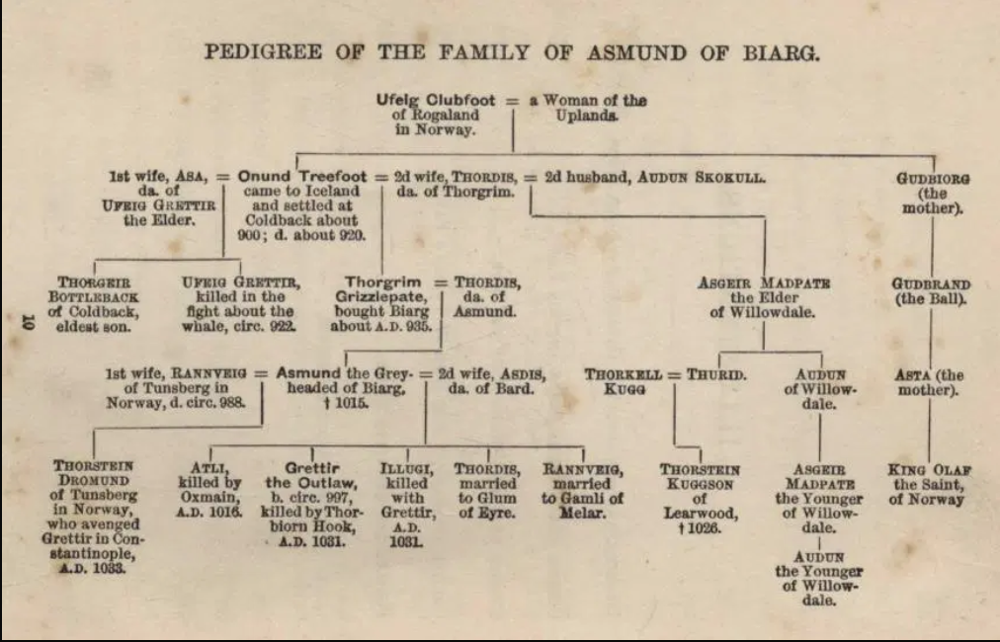
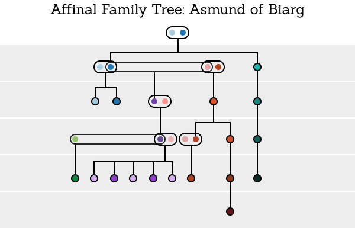

# Saga Family Tree Visualizations

Development of a affinal tree visualization for the display of familial connections for overlapping families and saga (stories). The software should be functional as a storytelling tool and

- [Saga Family Tree Visualizations](#saga-family-tree-visualizations)
  - [Reference Images](#reference-images)
  - [Requirements](#requirements)
    - [Version 1: Simple Single Family Affinal Tree](#version-1-simple-single-family-affinal-tree)
    - [Version 2: Additional Dimension](#version-2-additional-dimension)
  - [Sibling Relationships](#sibling-relationships)
  - [References](#references)
    - [Family Echo Example Trees](#family-echo-example-trees)
    - [Sketches](#sketches)
    - [Genealogical](#genealogical)
    - [Graphics](#graphics)
    - [Hosting](#hosting)

## Reference Images

## Dev Log

### 05/26

- Moved from rollup to webpack
- Cleaned up types and synced tsconfig with webpack and vscode 

### 05/27

- get CSS framework in place
- attach click handlers
- simple tree layout (very simple)

## Requirements

### Version 1: Simple Single Family Affinal Tree

- Pick and learn layout technology
- Establish graphical language
- Setup dev environments
- Base data structures
- Output simple tree

### Version 2: Additional Dimension

- Affordance for additional dimension

## Sibling Relationships

Various Tree algorithms.

[Tim Strehle’s Blog » Topic Maps (as a standard) are dead, I’m afraid](https://www.strehle.de/tim/weblog/archives/2015/06/14/1763)

[Building a Dynamic Tree Diagram with SVG and Vue.Js](https://javascriptweekly.com/link/65085/bb27aa4ba9)

[Algorithm for Drawing Trees | Rachel Lim’s Blog](https://rachel53461.wordpress.com/2014/04/20/algorithm-for-drawing-trees/)

## References

### Family Echo Example Trees

- [Grim](http://www.familyecho.com/?p=CN4BS&c=b899bews5y&f=584050702172786993)
- [Droplaugarsona](http://www.familyecho.com/?p=CN4BS&c=b899bews5y&f=584050702172786993)
- [Gisli](https://www.familyecho.com/?p=START&c=sbkt6ol82x&f=668113241967122657)
- [Ketil](https://www.familyecho.com/?p=KJISO&c=will1jxco3&f=668113241967122657)

### Sketches

- https://observablehq.com/@elvezpablo/asmund-saga-tree-visualization
- https://observablehq.com/d/2b7c4b353949c8cb
- https://observablehq.com/@nitaku/tangled-tree-visualization-ii

### Genealogical

- [Example of complex relationships](https://www.genopro.com/tutorials/second-marriage/)
- [Genealogical Terms](https://support.ancestry.com/s/article/Glossary-of-genealogical-terms)
- [Interactive Tree Video](https://www.youtube.com/watch?v=-FkRzDegzAo)
- https://aviz.fr/geneaquilts/

### Graphics

- [Colors](https://observablehq.com/@d3/color-schemes)
- [Figma Tree Sketches](https://www.figma.com/file/RxjS1lBz9inXkHjYqwO9hC/SagaTreeRelationships?node-id=1%3A2)
- Dark Color Scheme pairs `["#a6cee3","#1f78b4","#b2df8a","#33a02c","#fb9a99","#e31a1c","#fdbf6f","#ff7f00","#cab2d6","#6a3d9a","#ffff99","#b15928"]`

### Hosting 

- [AWS Research Credits](https://aws.amazon.com/research-credits/)